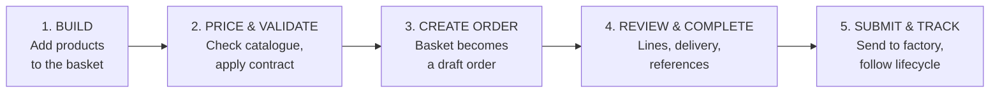
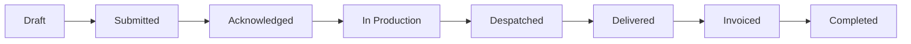

# EOS 2.0 - The "Normal" Order: The Standard Journey

**Author:** Jamie Ladd (Product Owner, EOS Cloud)
**Status:** Proposal for review
**Audience:** Management / EOS 2.0 steering

---

## 1. Why this document exists

EOS 2.0 supports several order types - Normal, Direct, Showroom, MockUp, FOC, Swatch Request and Sample. If we design each one as its own bespoke workflow, we end up with seven mini-products to build, test and support.

Instead, we define **one canonical journey - the "Normal" order** - and treat every other type as a controlled deviation from it. Get Normal right and:

- Users learn **one** flow and reuse it everywhere.
- The dev team builds **one** pipeline and configures the variations.
- Every future order type has a clear baseline to be measured against ("what's different from Normal?").

**Normal is the 80% case.** It is the standard sale of Herman Miller product to an end customer, at contract price, delivered to a site. This document proposes the end-to-end route a user takes to raise one, and shows how the other types branch off it.

> This is the **target flow** we are proposing. Most of it is already demonstrable in the EOS 2.0 prototype, so this is a description of a direction we can already show, not a theoretical concept.

---

## 2. What makes an order "Normal"

A Normal order has these defining characteristics. They are the reference points that every other type deviates from:

| Dimension | Normal order behaviour |
|---|---|
| **Commercial** | Sold to an end customer; priced against a live contract/price code |
| **Products** | Standard, catalogue (PDM) products - configured via article code + feature string |
| **Pricing** | List price with contract discount applied; a real order value |
| **Delivery** | Physical delivery to a customer site address |
| **Fulfilment** | Placed with the Herman Miller factory (via TradeNet) and manufactured to order |
| **Finance** | Invoiced through the finance system (Dynamics 365 / Business Central) |
| **Approval** | No special approval - the standard submission gate applies |

If an order changes one or more of these dimensions (e.g. no charge, no end customer, samples instead of product, drop-shipped), it is a **deviation** - see Section 6.

---

## 3. Design principles

The Normal journey is built to be **clear, easy to use, and logical**. Five principles guide it:

1. **One linear path.** The user always knows where they are and what comes next. Build → Price → Create → Review → Submit.
2. **Progressive disclosure.** Only ask for what's needed, when it's needed. Header detail is captured after the products are in, not before.
3. **Validate early, fail cheap.** Products are checked against the catalogue *in the basket*, before an order exists - so problems surface at the cheapest point to fix them.
4. **No dead ends.** Every error state has a next action (fix the code, add a special, remove the line). The user is never stuck.
5. **Nothing leaves until it's ready.** Submission is gated - an order can only go to the factory when it is complete and valid. Draft work is always safe.

---

## 4. The journey at a glance

Five stages. The first two happen in the **basket**; the last three happen in the **order**. The hand-off ("Create Order") is the single moment a loose basket becomes a committed, tracked record.

---

## 5. The five stages in detail

### Stage 1 - Build the basket

**User goal:** Get the products the customer wants into EOS.

**What the user does:**
- Lands on the Import page and adds products by any of:
  - **Uploading a file** - a pCon design export (`.eos` / OBX), a legacy OrderPlace file (SIF), or an Excel template.
  - **Pasting or typing article codes** directly (article code + feature string).
- Items flow into a **basket** - a working list of lines with quantity, product code, feature string and description.

**What the system does:**
- Parses the file, extracts each line (product code, feature string, quantity) and drops it into the basket.
- Handles nested / grouped items (e.g. pCon "super products") as a parent line with its components underneath.

**Why it's designed this way:** The basket is deliberately *pre-commitment*. Nothing has been ordered yet, so the user can experiment freely - add, remove, re-import - with no consequences.

**Already in the prototype:** File drag-and-drop, OBX/SIF/Excel parsing, article-code paste, and the basket table.

---

### Stage 2 - Price & validate

**User goal:** Confirm every line is a real, orderable product at the right price.

**What the user does:**
- Selects the **contract** the order is priced against.
- Reviews the basket, now enriched with product names, list prices and a running total.
- Resolves any flagged lines (see below).

**What the system does:**
- **Validates every line against the catalogue (PDM):** confirms the article code + feature string is a known, active product and returns its name and list price.
- **Applies contract pricing:** resolves the discount/price for each line against the selected contract and calculates the line and basket value.
- **Flags each line with a clear status:**

| Line status | Meaning | User's next action |
|---|---|---|
| **Valid** | Found in catalogue, priced | None - ready to go |
| **Not found** | Code not recognised | Correct the code, or add as a "special" |
| **Invalid config** | Feature string not valid for the product | Fix the feature string |
| **Inactive / superseded** | Product exists but is discontinued | Swap for the current product |

**Why it's designed this way:** This is the "fail cheap" principle in action. By validating and pricing *in the basket*, the user gets a trustworthy total and a clean line set **before** an order is created - so a Normal order starts life already correct.

**Already in the prototype:** Catalogue lookup (mocked PDM), contract selection, line pricing and basket totals, line-status flagging.

---

### Stage 3 - Create order

**User goal:** Turn the validated basket into a real, tracked order.

**What the user does:**
- Clicks **Create Order**.

**What the system does:**
- Creates a new order in **Draft** status, defaulted to **Order Type = Normal**.
- Carries every basket line into the order as an order line, preserving product, quantity, pricing and validation state.
- Generates the order reference and moves the user to the Order Detail page.

**Why it's designed this way:** This is the single, deliberate commitment point. Before it, work is a disposable basket; after it, work is a persisted order with a reference, an owner and a lifecycle. Making it one explicit button keeps that boundary obvious.

**Already in the prototype:** Create Order from basket, defaulting to Normal, landing on Order Detail.

---

### Stage 4 - Review & complete

**User goal:** Add the commercial and delivery detail, and make final line adjustments.

This stage has two halves - the **order header** and the **order lines** - presented on one page so the user sees the whole order in context.

**Order header (the "who / where / against what"):**
- **References:** order reference, customer PO number, description.
- **Customer & delivery:** delivery address (with address lookup to speed entry) and delivery contact (name, email, phone).
- **Commercial context:** order type (Normal), contract, pricing date.

**Order lines (the "what"):**
- The full line table: article code + feature string, description, quantity, list price, discount, line value, lead time and delivery date, and line status.
- Per-line actions: edit the configuration inline, adjust quantity, set delivery date, duplicate, delete, and expand/collapse super products to see their components.
- Search within lines and add new lines directly.

**What the system does:**
- Recalculates values as lines change.
- Derives lead times and delivery dates from the catalogue.
- Keeps the order safe throughout via **Save Draft** - the user can leave and return without losing work.

**Why it's designed this way:** By the time the user reaches this stage, the hard part (getting products right) is done. This stage is about *completing* the order, and progressive disclosure means the header detail is asked for only now - once there's a real order to attach it to.

**Already in the prototype:** Order header with delivery address lookup and contact fields, order type selector, the full order-lines table with inline editing, quantity stepper, super-product expand/collapse, line statuses, and Save Draft persistence.

---

### Stage 5 - Submit & track

**User goal:** Place the order with Herman Miller and follow it through to delivery and invoice.

**What the user does:**
- Reviews the action bar: **Cancel / Save Draft / Submit Order**.
- Clicks **Submit Order** once the order is complete.

**What the system does:**
- **Runs the submission gate.** Submit is only enabled when the order is valid: **every line resolved** and the required header fields present - **Reference, Purchase Order and Delivery Address**. If anything is missing, the bar tells the user exactly what ("Resolve invalid lines" / "Missing for submission: …"). Save Draft is always available and only needs a reference, so work is never trapped.
- **Sends the order to the factory** (via TradeNet), moving it from Draft into the live lifecycle.
- **Tracks it through the lifecycle**, surfaced to the user as status pills on the order list and detail:

- Exception states sit alongside the happy path: **On Hold** and **Cancelled**.
- Finance (invoicing/payment) is owned by Dynamics 365 / Business Central; EOS reflects the invoiced status rather than owning it.

**Why it's designed this way:** The gate enforces the "nothing leaves until it's ready" principle - the factory only ever receives clean orders. After submission, the user's job shifts from *building* to *tracking*, and the status pills give them an at-a-glance answer to "where is my order?".

**Already in the prototype:** Action bar with validation-gated Submit, Save Draft, status colour-coding and the order list with lifecycle tabs (Active / Completed / Archived).

> **Lifecycle note for the team:** the proposed lifecycle above reconciles EOS 1's factory states (Submitted → Acknowledged → Picking → Despatched → Invoiced) with the prototype's user-facing status pills. Finalising the exact set of user-visible statuses is a small follow-up decision.

---

## 6. How the other order types deviate from Normal

Every other type is **Normal, with something changed**. The value of this model is that we describe each type by its *difference*, not from scratch. The deviations cluster on four dimensions: **Pricing**, **Delivery**, **Products/Catalogue**, and **Approval**.

| Order type | What changes vs Normal | Complexity vs Normal |
|---|---|---|
| **Direct** | Fulfilment/delivery differs - shipped direct rather than through the dealer's normal route | Similar |
| **Showroom** | Commercial context differs - dealer's own showroom, showroom pricing, end customer may be the dealer itself | Slightly simpler |
| **MockUp** | Commercial terms differ - evaluation/trial units, often time-limited or loaned | Similar, +approval |
| **FOC (Free of Charge)** | Pricing removed - zero value; pricing/validation relaxed; typically needs approval | Simpler flow, +approval |
| **Swatch Request** | Products differ - fabric/finish swatches, not configured product; minimal basket, expedited | Much simpler |
| **Sample** | Products differ - sample units rather than a full configured order | Simpler |

**The strategic point for management:** we are not building seven order journeys. We are building **one** journey (Normal) and a small set of **configurable rules** that switch on/off per type - pricing behaviour, delivery behaviour, catalogue scope and approval. That is dramatically cheaper to build, test and support, and it keeps the experience consistent for users.

This is also the *honest* current state: in the prototype, Order Type is captured on the order but is otherwise **just a label** - a Normal order and a Showroom order behave identically today. That is exactly why nailing the Normal baseline first is the right sequence: once the standard journey is solid, the deviation rules become the well-defined, incremental piece of work rather than seven parallel unknowns.

> Exact commercial rules per type (e.g. what approval FOC requires, how Showroom pricing resolves) are a follow-up to confirm with the business. This proposal fixes the *model*; the per-type detail is the next layer down.

---

## 7. What this gives us

- **For users:** one flow to learn; a logical left-to-right path; no dead ends; drafts always safe; a clear answer to "where is my order?".
- **For the dev team:** one pipeline to build and one to test; deviations are configuration, not new code.
- **For the business:** a consistent, auditable order process; a clean baseline that makes adding or changing order types a small change rather than a project.

---

## 8. Decisions we need from management

1. **Endorse the "baseline + deviation" model** as the strategy for all order types.
2. **Confirm the five-stage Normal journey** (Build → Price → Create → Review → Submit) as the standard.
3. **Agree the target lifecycle / status set** (Section 5) so the team can finalise the status pills.
4. **Prioritise the per-type deviation rules** (Section 6) for a follow-up definition round.

---

*Grounded in the EOS 2.0 prototype and analysis of EOS 1 (order lifecycle, PDM, TradeNet, contracts and Dynamics 365 integrations).*
